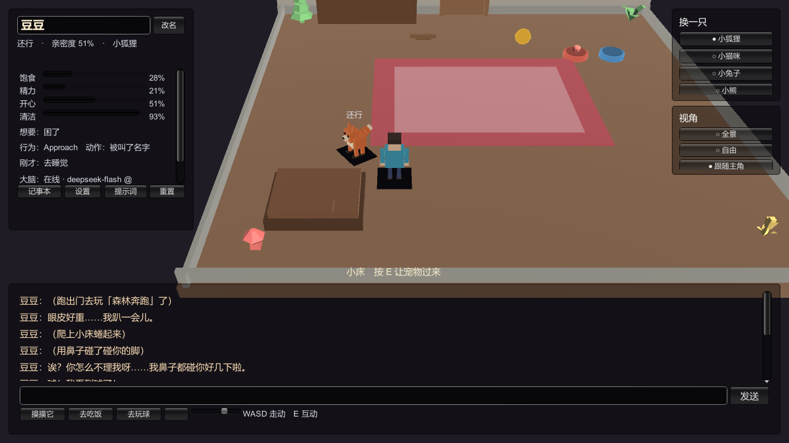
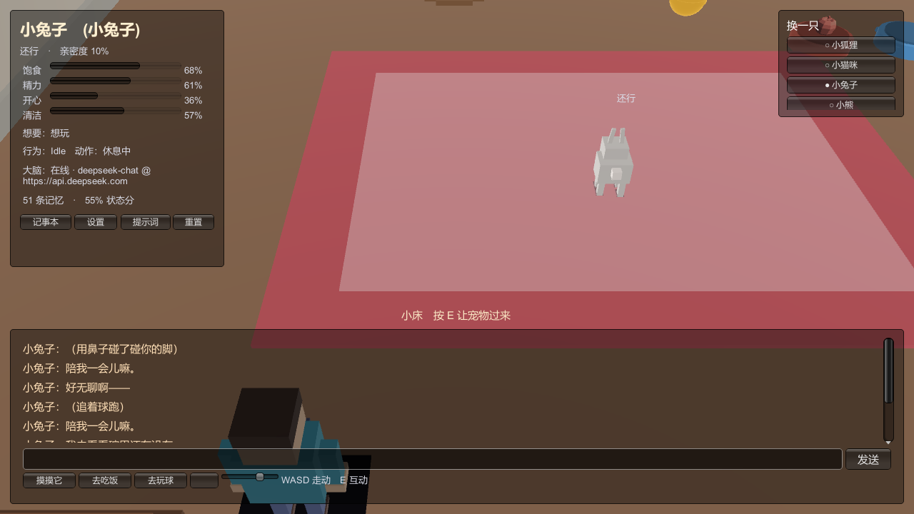
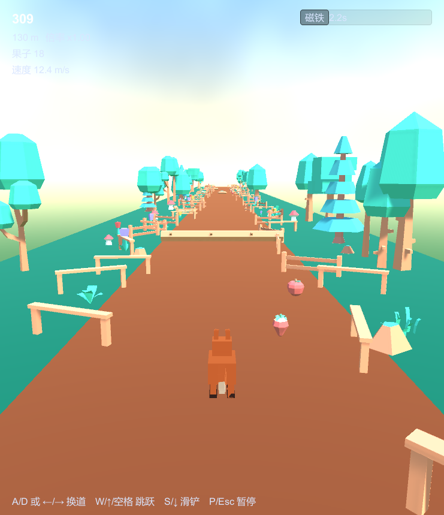
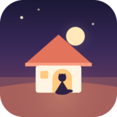
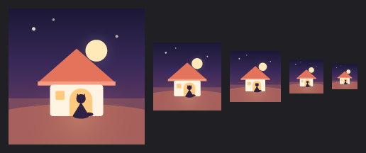
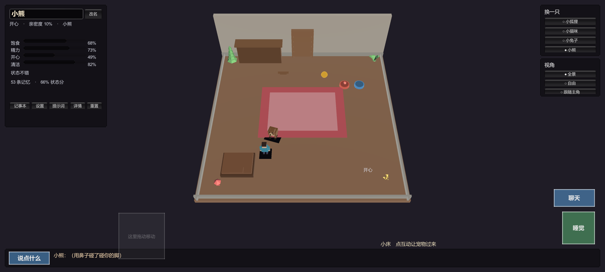
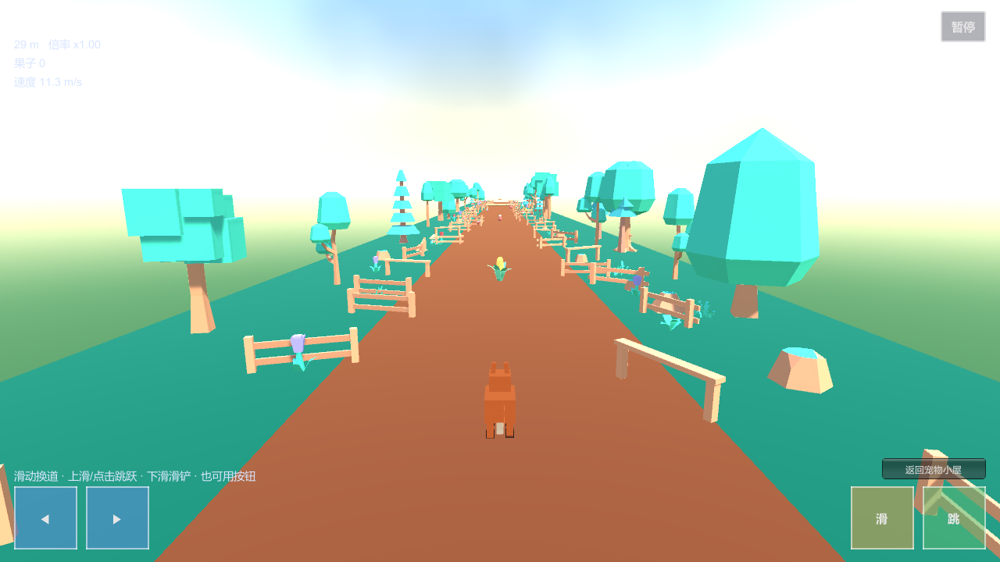
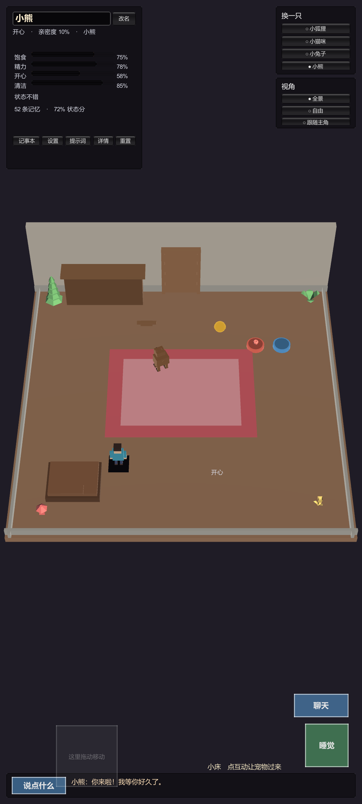
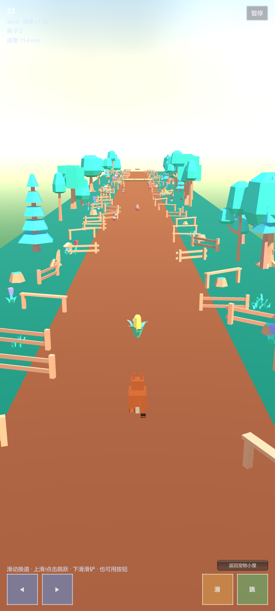

# RoomPet ·「虚拟宠物空间」

> 一个 Unity 小游戏项目：**和一只会记事、会主动找你说话的宠物住在同一个房间里**。
> 附带一个同世界观的动物主题**跑酷**小游戏，从房间的门出去就能玩。



| 宠物房间（PetRoom） | 跑酷（Main） |
|---|---|
|  |  |

**手机端（横屏 / 竖屏都支持）**：两套界面都有专门的触屏布局，操作按钮、摇杆、聊天条都按拇指位置重排过；
竖屏下相机会自动往后退，保证整个房间 / 整条赛道仍在画面里。

| 应用图标（自适应 / 圆形 / 传统） | 在启动器上的大小 |
|---|---|
|  |  |

图标也是**代码画出来的**（黄昏的小房子 + 门口灯光里的猫 + 月亮），
用 `Tools/DSH Mobile/Icons/Rebuild App Icon` 重新生成，改调色板只要改几个常量。

| 宠物房间 · 手机横屏 | 跑酷 · 手机横屏 |
|---|---|
|  |  |

| 宠物房间 · 手机竖屏 | 跑酷 · 手机竖屏 |
|---|---|
|  |  |

---

## 这是什么

两个场景，一套世界：

- **`Assets/Pet/Scenes/PetRoom.unity`** —— 虚拟宠物。文字陪伴 + 环境互动：
  宠物有自己的需求（饱食/精力/开心/清洁）、情绪、**日程表式的持久记忆**（UI 做成月历「记事本」）、
  **主动与被动两层行为表**（它会自己饿了去吃饭、自己凑过来找你），以及一个接大模型的可换"大脑"。
  房间里的饭碗、水碗、小床、小球、梳子都能点，玩家角色可以在屋里自由走动、把球扔出去让它捡。
- **`Assets/Scenes/Main.unity`** —— 动物主题跑酷。键盘左右换道 + 跳跃，无限循环赛道随机生成障碍，
  距离越远难度越高分越高，有关卡模式与道具系统。

两者通过房间里的**门**连接：门 → 选择去玩 → 跑酷 → 回来时宠物还记得你。

### 特点

- **全部程序化生成**：房间、家具、角色、毛发、音效都是代码生成的，
  除少量 CC0 素材外不依赖任何外部资源（见 [THIRD_PARTY.md](THIRD_PARTY.md)）。
- **声音零资源**：16 个音效 + 按心情变调的"说话"音全部由波形合成，不需要下载也不需要 API key。
- **大脑可换**：默认指向 DeepSeek 官方接口，任何 OpenAI 兼容端点都能填；
  网络不可用时自动落到离线大脑并**把错误显示出来**，不会让你对着空白发呆。
- **手机能玩**：安卓端有独立的触屏层（多点触控、浮动摇杆、滑动手势）、按屏幕短边自适应缩放的 HUD、
  安全区避让、横竖屏都支持的相机取景，以及轻/中/重三档**振动反馈**（可在设置里关掉）；
  跑酷**只用滑动操作**，桌面上则保留键盘。两边同一份代码。
- **摸得到的宠物**：点一下宠物它会按性格和心情做出反应——蹭你的手、翻肚皮、蹦开又回来，
  或者干脆假装没发现；每只的**叫声不一样**（物种定音区、性格做弯折：熊低沉、兔子高快、
  狐狸三连音、黏人的尾音上扬）。宠物叫声可以在设置里一键关掉。
- **宠物币与图鉴**：跑酷赚的币能在**商城**领新伙伴，**仓库**不限量存放，
  **背包**最多带三只进屋——背包里的每只都会在房间里走动、都能摸；只有"主要照顾"的那只
  接大脑与记忆（多只会成倍消耗 token，面板里会直说）。
- **宠物有性格**：每只动物四维性格（活力/黏人/好奇/讲究）配一个原型名，
  影响它想做什么、需求掉多快、以及它自己怎么说话；按物种稳定生成，可一键重掷。
- **每只宠物一张状态卡**：带多只宠物进屋时，状态面板顶部是**宠物名字页签**——
  点页签、或者直接点屋里那只宠物，都会切到它的卡片（它自己的需求条、性格与音色）；
  卡片可以折叠，收起后只剩页签与一行摘要，房间整块露出来。
- **会搬家**：房间里的**门**现在是一张**地图**——小屋（0 币）/ 花园（500）/ 夜晚露台（900），
  用跑酷赚的宠物币解锁。换地方不只是换配色：花园里宠物更开心但也更容易玩脏，
  夜晚露台更容易犯困，连环境光都会跟着变。
- **宠物之间会交流**：背包里放第二只、第三只，屋里的宠物会互相打招呼、追闹、让食、
  闹别扭或者挤在一起睡——按两只的性格挑，用的是**本地文案表，零 token**
  （只有你和"主要照顾"那只说话才走大模型）。
- **七个小游戏**：🧩 **拼图**在屋里玩，图片是按你当前住的房间和这只宠物**现画**出来的；
  🐦 **小鸟飞行**点一下扇翅膀钻管子（管子是按"小鸟飞得到"生成的，**不会出现过不去的组合**）；
  🎯 **跳一跳**按住蓄力、松手起跳，主角就是**你养的那只小动物**；
  🧺 **接果子**在屏幕上左右滑动，篮子跟着手指走，接的是**真的水果蔬菜**（苹果/橘子/梨/香蕉/
  胡萝卜/番茄，全是基本体搭的）；🃏 **记忆配对**翻开两张一样的**小动物**（猫/狗/兔/熊/狐狸/
  熊猫/猪/青蛙，全是代码画出来的）就消掉，分 **简单 / 中等 / 困难**三档，档位越高盘面越大、
  给的币越多；🔪 **切水果**滑动切开飞起来的水果，有**无尽模式**和**八关闯关模式**
  （每关目标分都是"这一关拿得到的分"的一部分，并且有测试证明完美玩家一定过得去）；
  🐷 **弹弓小鸟**把小鸟弹出去砸掉躲在结构里的猪——**每一关都是随机搭的，但生成器会先用
  同一套规则自己打一遍，打不通就换一关**，所以不会遇到"这关过不去"；**木块/石块/冰块是有物理的
  刚体**（会翻倒、滑动、互相压塌，塌下来能压死猪），拉弓有**橡皮筋**，还有**可开关的抛物线提示**。
  七个都赚宠物币，和跑酷进同一份钱包。
- **宠物之间会过日子**：屋里放两只以上的宠物，它们会自己打招呼、追闹、挤在一起睡，
  玩得好了还会**多一只宝宝**——宝宝的物种随父母之一、性格是两只混起来的，面板上会写它
  生在谁家；不想要的宠物也能**卖回商店**换宠物币。
- **点谁就主要照顾谁**：点房间里那只宠物、或者点它的状态卡页签，它就接管这个房间
  （大脑、记忆、记事本、饭碗都跟着它走），原来那只自动变成同伴。
- **它知道东西都在哪**：宠物对房间有**实时的空间感知**——你站哪、饭碗/水碗/猫砂盆/小床/球在哪、
  离它几步、在它的哪个方位（正前方/右前方/…，按**它自己的朝向**算），全部写进它这一轮收到的
  提示词（【你看到的东西】）。所以问「饭碗在哪」它会**真的照着看**回答，而不是编；
  它也会自己走过去和这些东西或者**和你**互动（多了一条「凑到主人身边」的自主行为）。
- **它听得懂短指令**：**「过来」「别动」「跟着我」「拿球」「吃饭」「喝水」「陪我玩」「去睡觉」
  「上厕所」「洗澡」「梳毛」「饭碗在哪」**——打字或说话都行，**在手机上就地识别**（不联网、
  不花 token、同一帧就动起来）。为了不把聊天当命令，它保守到偏执：疑问句（「你吃饭了吗」）、
  陈述句（「我今天吃了饭」）、长句、带主语的一律不当指令；真做不了时它会**说实话**
  （「唔……碗里好像没有东西」）。
- **可以说给它听**：手机上聊天栏里有麦克风，按一下说话（会顺便展开聊天），识别到的字填进
  输入框，改一改再发送。第一次按会弹系统权限框，**同意之后会自动开始听**，不用再按第二次；
  万一识别失败，**失败原因是人话**（例如「系统语音服务断开了（错误码 11），再点一次麦克风重连」），
  写在聊天里并留在记录里（**一次点击最多一条**，不会刷屏），设置里还有一份「语音诊断」。
  语音识别器的创建会依次尝试**三种方式**（系统默认 / 点名每一个识别服务 / 本机离线），
  哪一种成了会写在诊断里——国产 ROM 上"系统里有识别服务但默认的那个用不了"很常见。
- **宠物会说话**：除了程序化叫声，宠物说的话会**朗读**出来——用手机自带的语音引擎，
  按这只宠物的音色调整音调与语速；只念说的话，括号里的动作不会被念出来。**默认打开**，
  聊天栏右下角就有「朗读：开 / 朗读：关」一键切换（旁边还有「音效：开/关」），
  设置里另有「▶ 测试朗读」可以当场试。
- **日子是要过的**：会饿、会困、会想你、会脏，也会**憋不住**——
  来不及跑到猫砂盆就会出事，地上留下污渍等着你收拾。
- **界面是画出来的**：面板、气泡、圆角与投影都是运行时程序化生成（`UiSkin`），
  连小动物的头像也是逐像素画的（`PetAvatarArt`），跑跳的小游戏主角则是用基本体搭的
  3D 小动物（`MiniAnimal`），连同图标、音效一起，仓库里没有一张贴图。
- **312 条单元测试**覆盖逻辑（行为打分、性格偏置、日记裁剪、赛道可通过性、
  界面几何与按钮可达性、触控命中判定与场景切换、卡片互不重叠、地图与场景影响、宠物交流、
  拼图的完整可解性、小鸟飞行的**可通行生成**（含"自动驾驶飞完 150 管 × 20 种子"）、
  接果子的拖动与边界、水果轮转、记忆配对的难度与奖励、头像"八张脸互不相同"、
  小动物的物种映射与造型部件、接触阴影的渐变、平台跳跃的碰撞与关卡可通过性、
  **跳一跳的"每一跳都跳得到"（逐跳模拟 250 跳）与相机取景（从窄到宽的 8 种屏幕比例）**、
  **宠物的方位说法与八向、指令解析的"什么不是指令"**、
  **弹弓小鸟的刚体（塔不倒 / 拆腿必塌 / 一发必须打散结构）与关卡缓存的精确往返**、
  音色与语音文字处理、相机取景）。

---

## 快速开始

1. **装 Unity**：`2022.3.62f3c1`（其它 2022.3.x 一般也行）。Built-in 渲染管线，不需要 URP/HDRP。
2. **克隆并打开工程**：

   ```powershell
   git clone https://github.com/codesknight/roompet
   ```

   用 Unity Hub 打开仓库里的 `UnityMCPProject/` 目录。首次打开会导入资源，几分钟。

3. **跑起来**：打开 `Assets/Pet/Scenes/PetRoom.unity`（或 `Assets/Scenes/Main.unity`），按 Play。

> 仓库里的 `UnityMCPProject/Packages/manifest.json` **不包含** AI 开发工具（MCP for Unity）的依赖：
> 那是本机的开发环境，不是游戏的一部分，所以克隆下来直接打开就是一个干净、零报错的工程。
> 想接上这套工具链（让 AI 直接操作编辑器），按 [docs/MCP_SETUP.md](docs/MCP_SETUP.md) 做，
> 其中第 3.3 节就是"加一行依赖"。

---

## 操作

| 场景 | 按键 | 作用 |
|---|---|---|
| 宠物房间 | `W A S D` | 走动（相机相对） |
| 宠物房间 | `E` | 和身边的东西互动（喂饭/喝水/梳毛/睡觉/拿球/开门） |
| 宠物房间 | 鼠标左键（拿着球时） | 按住蓄力，松开扔出去 → 宠物会跑去捡回来 |
| 宠物房间 | 右键拖动 / 滚轮 / 中键 | 「自由」视角下转视角 / 缩放 / 平移 |
| 宠物房间 | `Esc` | 关掉当前面板 |
| 跑酷 | `A` `D` / `←` `→` | 左右换道 |
| 跑酷 | `空格` / `W` / `↑` | 跳跃 |

**手机上的小游戏都有暂停**（切水果、弹弓小鸟的右上角都有「暂停」），暂停**不改全局时钟**，
所以不会出现"从小游戏回到房间人物不动"的老问题。

**和宠物说话时可以直接下指令**（打字或语音都行，本地识别，不花 token）：
「过来」「别动」「跟着我」「拿球」「吃饭」「喝水」「陪我玩」「去睡觉」「上厕所」「洗澡」「梳毛」
「饭碗在哪」。它不是关键词匹配的玩具——疑问句、陈述句、长句都不会被当成指令，
而它答不上来时（比如碗里没东西、球不在）会**当场说清楚**。

**手机上（横屏或竖屏都行）**：

| 场景 | 操作 | 作用 |
|---|---|---|
| 宠物房间 | 左下拖动 | 浮动摇杆走动（手指按在哪，摇杆就在哪） |
| 宠物房间 | 右下按钮 | **互动**（拿球/开门/让宠物过来）· 拿着球时多一个**按住蓄力/松手扔出** · **聊天** |
| 宠物房间 | 底部横条 | 收起的聊天：显示宠物最后一句话，点「和它说说话」展开输入 |
| 宠物房间 | 右半屏拖动 / 双指捏 | 「自由」视角下转视角 / 缩放 |
| 跑酷 | 左右滑动 | 换道 |
| 跑酷 | 上滑 / 点击 | 跳跃（按住更高）；下滑：滑铲 |
| 跑酷 | 右上角 | 暂停（**跑酷没有方向键了，全靠滑动**，第一次进会弹一次手势教学） |

**界面的样子**：宽屏时对话是右侧边栏（气泡式记录 + 大号输入框），
窄屏时是底部面板；面板、气泡、圆角与投影都是运行时程序化生成的，没有一张 UI 贴图。

**振动反馈**：换道/跳跃/滑铲、拿球/扔球、宠物把球叼回来、撞车、通关都会震一下，
强度分轻/中/重；不想被震就去「设置」面板关掉（手机端专属开关，选择会记住）。
编辑器里不会震——没有设备时它是一个空操作，所以桌面端行为一条没变。

多指是分开处理的：左手推摇杆的同时右手可以点按钮、拖视角。
真机上的手机布局也能在编辑器里预览：`Tools/DSH Mobile/Toggle Touch Preview`（`Ctrl+Shift+T`），鼠标会当成一根手指；
再配 `Tools/DSH Mobile/Preview/…` 把 Game 视图切成手机尺寸（竖屏/横屏/平板各一档）即可照真机比例看。

界面都在屏幕上：左上角是宠物状态与**名字输入框**，右上角是**换动物**和**视角切换**，
底部是聊天框（打字和它说话）。左下角一排按钮：**记事本**（日历形式的记忆）、
**宠物**（商城/仓库/背包的图鉴）、**地图**（换地方 + 去小游戏）、**设置**（大模型接口与声音开关）、
**提示词**（看/追加它实际收到的提示词）、**重置**。
手机端聊天默认收成一条，状态面板默认只显示要点，其余进「详情」。

---

## 文档导航

| 文档 | 内容 |
|---|---|
| [docs/BOARD.md](docs/BOARD.md) | **开发板**：需求 / 待办 / 已完成一张表，并区分"做了并验证"与"只写了计划" |
| [docs/REQUIREMENTS.md](docs/REQUIREMENTS.md) | **需求与实现对照**：每条需求 → 怎么实现的 → 验收证据；含被测试钉住的 15 条不变量 |
| [docs/BOARD.md](docs/BOARD.md) | **仓库里的开发板**：需求一行一条，状态 / 轮次 / 证据，明确区分"做了并验证"与"只写了计划" |
| [docs/DEVLOG.md](docs/DEVLOG.md) | **开发日志与交接**：代码地图、环境事实、**57 条踩过的坑**、验证工作流 |
| [docs/MCP_SETUP.md](docs/MCP_SETUP.md) | **AI 开发工具链**：用 MCP for Unity 让 AI 直接操作编辑器，以及别的工程怎么复用 |
| [docs/ROADMAP.md](docs/ROADMAP.md) | 路线图与待办（也是开 issue 的来源） |
| [docs/VISUALS.md](docs/VISUALS.md) | 毛发/彩虹/天空盒等着色器与材质参数 |
| [PET_DESIGN.md](PET_DESIGN.md) | 虚拟宠物分轮设计记录（含设计理由与实测数据） |
| [GAMEPLAY.md](GAMEPLAY.md) | 跑酷玩法与关卡设计说明 |
| [CHANGELOG.md](CHANGELOG.md) | 变更记录 |

---

## 项目结构

```
roompet/
├─ UnityMCPProject/          Unity 工程（用 Hub 打开这个目录）
│  ├─ Assets/
│  │  ├─ Scripts/            跑酷：核心/玩家/赛道/道具/相机/界面
│  │  ├─ Pet/Scripts/        虚拟宠物：核心/大脑/记忆/行为/世界/界面/音频
│  │  ├─ Mobile/             手机端：多点触控层 / 摇杆 / 手势 / HUD 缩放 / 安卓打包菜单
│  │  ├─ Shaders/            ShellFur / RainbowFur / DreamySkybox / Neon
│  │  ├─ Scenes/Main.unity   跑酷场景
│  │  └─ Pet/Scenes/PetRoom.unity  宠物房间
│  ├─ Builds/Android/        打包产物（被 git 忽略）
│  ├─ Packages/              包依赖（含可选的 MCP 开发工具那一行）
│  └─ ProjectSettings/       工程设置
├─ docs/                     文档与证据截图（见上表）
├─ scripts/                  部署与诊断脚本（install-server / verify_mcp / 探针）
├─ .assets/                  CC0 素材的原始下载（留档用）
└─ README.md
```

---

## 项目管理

计划与待办都在 GitHub 上，用**里程碑 + 标签 + issue** 组织，源头是 [docs/ROADMAP.md](docs/ROADMAP.md)：

| 里程碑 | 内容 |
|---|---|
| **v0.2 — 让它更像活的** | 语音输出（TTS）、宠物之间互相交流、会搬家的多场景地图、扔球落点指示、自由视角约束 |
| **v0.3 — 内容扩展** | 更多小游戏/物种/房间互动，为《虚拟小镇》铺路 |
| **v1.0 — 可发布** | 云存档、CI、打包、选定许可 |

标签按**领域**分（宠物／记忆／大脑·提示词／界面／相机／声音／跑酷／玩法／工具链／文档），
外加 `技术债`、`待验证` 和优先级 `P0`–`P2`。

这套配置是**可复现**的：跑一次

```powershell
powershell -File scripts/setup-github.ps1
```

就会写好仓库简介与 topics、建好标签与里程碑、把 `docs/ROADMAP.md` 里的待办开成 issue，
并为 `v0.1.0` 建一个 release。脚本是幂等的，重复跑只补缺的（认证用的是 git 已有的
github.com 凭据，脚本里不存任何 token）。

## 测试与验证

单元测试在 Unity 里跑：**Window → General → Test Runner → EditMode → Run All**，应 **312/312 通过**
（宠物 174 + 跑酷 15 + 手机端 44 + 小游戏 79）。

工程里还带了两个自检菜单（比手写脚本快）：

- `Tools/DSH Pet/Validate Wiring` —— 打印房间/角色/相机/小游戏/行为表/球/界面几何/大脑状态的完整报告。
- `Tools/DSH Runner/Validate Wiring` —— 跑酷侧的同类报告。

以及两个维护用的菜单：

- `Tools/DSH Pet/Build Pet Scene` —— 房间是代码生成的，改了摆放逻辑后跑它重建场景。
- `Tools/DSH Pet/Fix Script Encodings` —— 补 UTF-8 BOM / 报告被损坏的中文（见 DEVLOG 坑 1）。

手机端另有一组：

- `Tools/DSH Mobile/Report Mobile Status` —— 打印当前平台、触控开关、缩放、安全区、包名、架构。
- `Tools/DSH Mobile/Toggle Touch Preview` —— 在编辑器里用手机布局跑（鼠标当手指）。
- `Tools/DSH Mobile/Preview/…` —— 把 Game 视图切成真机尺寸（竖屏 1080x2400 / 横屏 2400x1080 /
  长竖屏 1080x2340 / 平板竖屏 1600x2560），**并一起模拟手机的屏幕密度**——
  编辑器是 96dpi、手机是 400-500dpi，而缩放里带 dpi 修正，不模拟的话预览出来的设计空间
  会比真机宽 20%，"在编辑器里验过的布局"就不是真机跑的那套。
  另有 `Report Current Viewport` 打印当前视口 / 方向 / dpi / 缩放 / 设计尺寸，
  `Use Platform DPI` 还原成平台值。
- `Tools/DSH Mobile/Configure Android Player Settings` —— 一键写回横竖屏/包名/IL2CPP+ARM64/INTERNET 等设置。
- `Tools/DSH Mobile/Icons/…` —— `Rebuild App Icon`（按代码重画四种图标并写进玩家设置）、
  `Render Size Preview Sheet`（把 192/96/72/48/36px 并排出图，先看小尺寸认不认得出）。
- `Tools/DSH Mobile/Build APK` —— 出包到 `UnityMCPProject/Builds/Android/RoomPet.apk`。

---

## 打包安卓端

**想直接装手机上玩？** 到 [Releases](https://github.com/codesknight/roompet/releases) 下最新的
`RoomPet.apk`（预发布，开发版）拷进手机安装即可，不用装 Unity。

**前置**：Unity Hub 里给 `2022.3.62f3c1` 装上 **Android Build Support**（含 OpenJDK / SDK / NDK）。
装模块必须在编辑器**启动之前**完成——运行中的编辑器不会加载新装的构建扩展，
出包会直接报 `Build target 'Android' not supported`（见 DEVLOG 坑 23）。装好后重启编辑器即可。

然后在编辑器里：

1. `Tools/DSH Mobile/Configure Android Player Settings`（已写进工程设置，一般不用再点）；
2. `Tools/DSH Mobile/Build APK`。

命令行等价写法：

```powershell
& "C:\Program Files\Unity\Hub\Editor\2022.3.62f3c1\Editor\Unity.exe" `
  -batchmode -quit -projectPath .\UnityMCPProject -buildTarget Android `
  -executeMethod DshMobileEditor.MobileBuildMenu.BuildApk -logFile -
```

产出的包信息：

| 项 | 值 |
|---|---|
| 输出 | `UnityMCPProject/Builds/Android/RoomPet.apk`（约 15 MB） |
| 应用名 / 包名 | `RoomPet` / `com.codesknight.roompet` |
| 架构 / 后端 | ARM64（仅此一种）/ IL2CPP |
| 最低 / 目标 SDK | 24 / 自动（当前 35） |
| 屏幕方向 | 横竖屏都支持（清单里是 `fullUser`），适配刘海安全区 |
| 权限 | `INTERNET`（大模型接口用）、`VIBRATE`（振动反馈用） |
| 版本 | `0.2.0`（`versionCode 1`） |

> 应用名是**打进生成的 Gradle 资源**的，不是改 `PlayerSettings.productName`——
> 那个字段在桌面端同时决定 `persistentDataPath` 与 PlayerPrefs 的位置，改它等于搬走存档
> （宠物会忘了你）。见 [docs/DEVLOG.md](docs/DEVLOG.md) 坑 30。

**关于 http**：宠物的大脑默认指向可配置的 OpenAI 兼容端点，如果填的是**局域网 http 网关**，
安卓 9+ 默认会拦掉明文请求。工程设置里是 `Insecure Http Option = Development Only`，
并且 `Assets/Mobile/Editor/MobileAndroidPackaging.cs` 会在**开发版**的清单里补上
`android:usesCleartextTraffic="true"`（发布版保持安卓的安全默认）。
所以要用明文网关，就出开发版包：`-buildTarget Android` 加上 `BuildOptions.Development`，
或者把设置改成 `Always Allowed` 并自行承担风险。

---

## 用 AI 驱动 Unity 开发（可选）

这个项目是用 [MCP for Unity](https://github.com/CoplayDev/unity-mcp) 配合 AI 助手开发的：
AI 可以直接在编辑器里建对象、改资源、跑编译、跑测试、截图看结果。
想在自己机器上复现这套工具链，看 **[docs/MCP_SETUP.md](docs/MCP_SETUP.md)**（含"新工程如何复用，不用重新部署"）。

仓库里**不包含**这份工具链本身（`unity-mcp/` 检出与 Python 环境都被 git 忽略），
所以克隆下来的是一个干净的游戏工程。

---

## 许可与第三方资源

见 [THIRD_PARTY.md](THIRD_PARTY.md)。简要说明：项目代码尚未选定开源许可（**待定**），
素材里有 CC0 的 Kenney 资源需要署名（已列出）。
